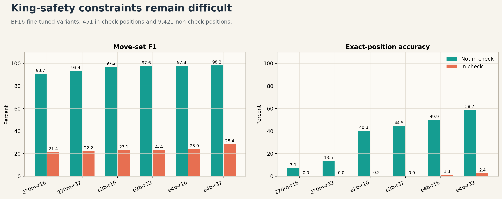
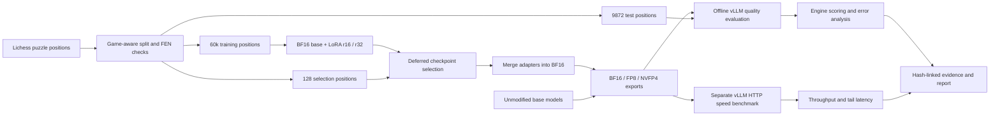
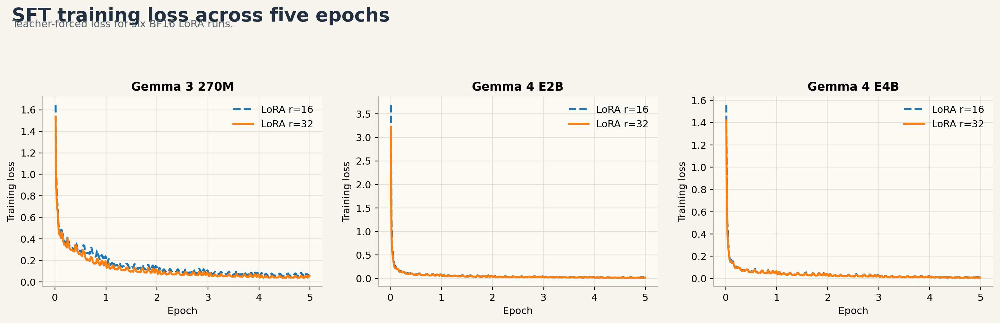
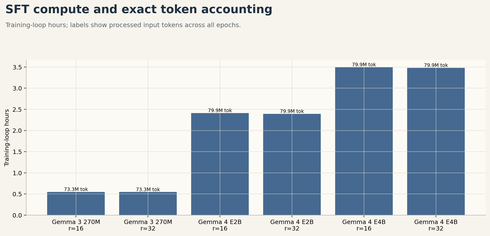
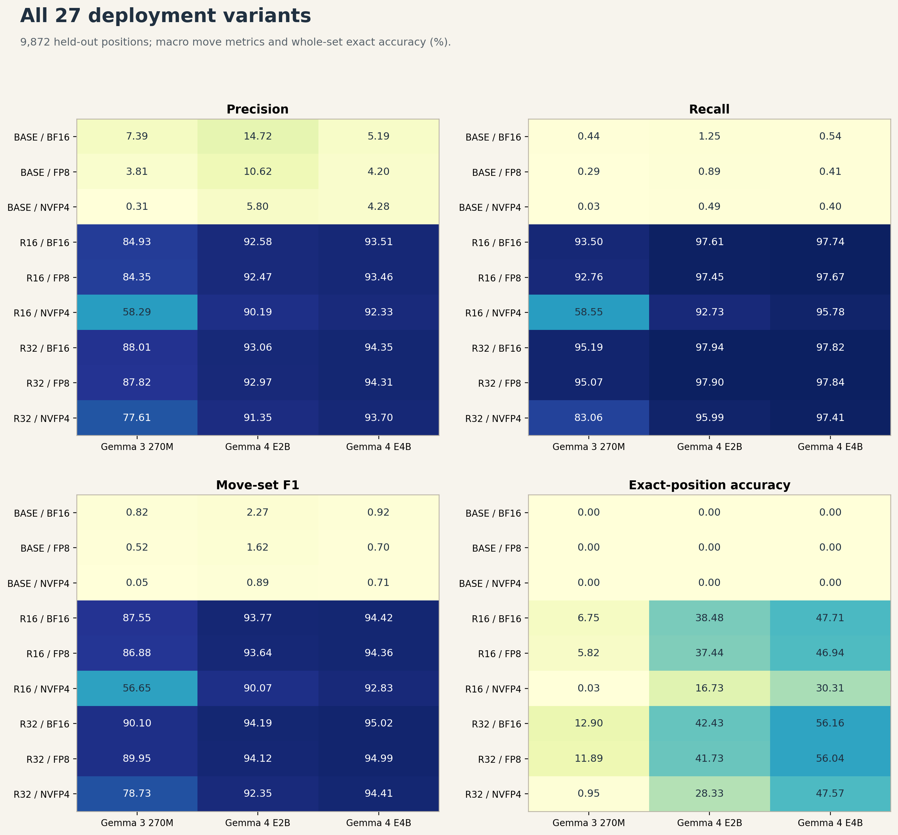
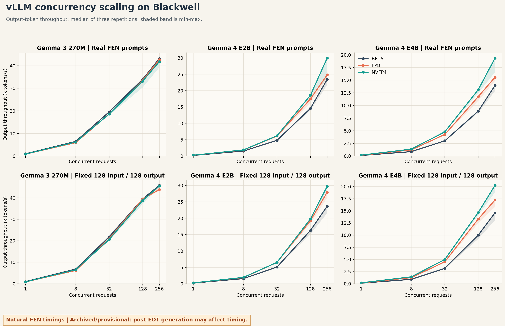

# LLM Chess Move Learning

**LoRA fine-tuning, post-training quantization, and reproducible vLLM evaluation for legal-move enumeration from FEN.**

[](https://github.com/ProttiProtto/llm-chess-move-learning/actions/workflows/evaluation-tests.yml)
[](LICENSE)

Can a small language model read a chess position and list **every legal move**, without a rules engine during generation? This project studies that question through six fine-tuning runs, 27 quality evaluations, and 270 serving-benchmark scenarios. A deterministic python-chess oracle makes errors measurable rather than subjective.

This is a legal-move enumeration benchmark, **not a chess engine, Elo evaluation, or claim of reliable general chess reasoning**. The models produce strong move-set overlap after fine-tuning, but complete correctness and king safety remain substantial weaknesses.

**Start here:** [Comprehensive v2 report and all figures](results/v2/REPORT.md) | [Dataset on Hugging Face](https://huggingface.co/datasets/ProttiProtto/lichess-fen-legal-moves) | [Model and adapter downloads](ARTIFACTS.md#hugging-face-repositories) | [Rebuild the analysis](analysis/README.md)

## Models and Dataset

The processed dataset, six selected LoRA adapters, and nine rank-32 serving checkpoints are staged in private Hugging Face repositories for final review. Their links will work for authorized reviewers now and for everyone after the repositories are made public. The [artifact catalog](ARTIFACTS.md#hugging-face-repositories) provides direct and immutable-revision links for every BF16, FP8, and NVFP4 checkpoint.

```python
from datasets import load_dataset

dataset = load_dataset("ProttiProtto/lichess-fen-legal-moves")
```

The GitHub source, evaluation contracts, compact evidence, and report are versioned separately from large model artifacts. Making the Hugging Face repositories public is an explicit release step; this README does not imply that private artifacts are currently accessible without authorization.

## Main Findings

The corrected v2 evaluation uses 9,872 held-out positions, excluding the 128-position checkpoint-selection set.

- **E4B-r32 BF16: 95.02% macro move-set F1, but 56.16% exact-position accuracy.** F1 measures overlap, not the percentage of fully correct positions.
- **King safety is the clearest failure mode:** E4B-r32 BF16 scores 98.21% F1 outside check versus 28.36% in check, with only 2.44% in-check exact accuracy. Check positions are 4.57% of the test set but contribute 63.55% of its illegal extras.
- **Rank 32 exceeded rank 16 in these single-seed BF16 runs** for all three model families. This is an observation, not a statistically established rank-scaling law.
- **FP8 largely preserved fine-tuned quality.** E4B-r32 FP8 scores 94.99% F1 and 56.04% exact accuracy. Historical natural-FEN throughput measurements are archived below rather than used as final deployment claims.
- **NVFP4 trades accuracy for compression differently across sizes.** E4B-r32 reaches 94.41% F1 and 47.57% exact accuracy. For 270M, NVFP4 substantially reduces quality in this workload.



The lead chart shows the quality gap between check and non-check positions, not a speed claim. In the report, quality-throughput plots pair full-test quality with a separate concurrency-256 speed experiment on the **same checkpoint hashes**. Every natural-FEN timing chart carries an **archived/provisional** warning inside the image because generation could continue after the first end-of-turn marker; these measurements are not final interactive-serving claims. Fixed 128 x 128 results remain a synthetic length-controlled hardware comparison, not chess accuracy or interactive latency.

## Pipeline



The rules engine generates labels and scores outputs; it **does not filter or repair predictions**. No engine-constrained decoding, RAG, or RL is used in the reported experiments.

## Techniques Used

| Technique | Implementation and purpose | Evidence boundary |
| --- | --- | --- |
| Parameter-efficient SFT | Freeze BF16 base weights; train LoRA attention/MLP projections with PEFT, ranks 16 and 32 | Six runs, one training seed each |
| Completion-only loss | Mask prompt and padding labels so optimization targets the move list | Exact supervised-token and input-token telemetry |
| Torch compilation | TorchInductor; full-model compilation for Gemma 3, regional decoder compilation for Gemma 4 | Enabled in training; no compile-off speedup ablation |
| Gradient accumulation | Microbatch 8 x accumulation 4 gives effective batch 32 | Same effective batch and exposure across these runs |
| Deferred checkpoint evaluation | Save intermediate Trainer checkpoints; evaluate separately on 128 positions | Generation-based selection is outside the training loop |
| Merge and PTQ | Merge the LoRA update into BF16, then export FP8 or NVFP4 | These are **not quantized-training or QAT results** |
| vLLM continuous batching | Offline LLM.generate for quality; streaming HTTP for latency/throughput | Nine rank-32 deployments, not all 27 speed-tested |
| Evaluation contracts | Shared prompt, model-specific EOT, parser truncation, content hashes | Avoids silently mixing checkpoints, prompts, and old results |
| Failure analysis | Check/non-check, legal-set size, illegal extras, generation limits | Descriptive, not proof of internal model algorithms |
| CPU tests and CI | Parser, oracle, splits, metrics, benchmark validation | Does not substitute for GPU integration tests |

### Training

Models: **google/gemma-3-270m-it**, **google/gemma-4-e2b-it**, and **google/gemma-4-e4b-it**.

| Setting | Measured runs |
| --- | --- |
| Training positions / epochs | 60,000 / 5 (300,000 example presentations) |
| Optimizer updates | 9,375 |
| Base precision | BF16; higher-precision LoRA adapters |
| LoRA rank / alpha / dropout | 16 / 32 / 0.05 or 32 / 64 / 0.05 |
| Targets | q_proj, k_proj, v_proj, o_proj, gate_proj, up_proj, down_proj |
| Optimizer / learning rate | Fused AdamW / 2e-4 |
| Weight decay / warmup | 0.01 / 3% (282 steps) |
| Microbatch / accumulation | 8 / 4 |
| Maximum sequence length | 512 |
| Training seed | 42 |
| Gradient checkpointing | Disabled |
| Hardware | NVIDIA RTX PRO 6000 Blackwell Server Edition |

LoRA learns a low-rank update, **delta_W = (alpha / rank) * B @ A**, rather than updating the entire base. After merging, adapter rank does not add a separate inference branch. Rank may still affect output length and natural-workload speed; only rank-32 speed was measured here.



Training took approximately **33 minutes for 270M, 144 minutes for E2B, and 209 minutes for E4B**, per run. Recorded loop time includes work such as compilation and periodic checkpoint saving; it is not pure GPU compute time. Single-run timing differences between ranks are not speedup evidence.

Each 270M run processed **73.28M non-padding input tokens / 39.02M supervised tokens**; each E2B/E4B run processed **79.88M / 40.82M**. Counts include repeated epochs, not unique corpus tokens. Different tokenizers and architectures prevent interpreting cross-family training loss as direct chess accuracy. Held-out loss curves are not available in these generation-based evaluation artifacts.



### Quantization

All low-precision results come from **post-training quantization of merged BF16 models**, not separately trained FP8/NVFP4 models.

| Deployment | Method | Important distinction |
| --- | --- | --- |
| BF16 | Merged base plus adapter update | Reference deployment |
| FP8 | FP8_DYNAMIC compressed-tensors export; quantized linear weights and dynamic activation scaling | Not simply changing the entire model's dtype |
| NVFP4 | NVIDIA ModelOpt W4A4; E2M1 values with block-of-16 FP8 scales and a higher-level scale | Weight **and activation** quantization, not NVFP4A16 |

Calibration uses 512 training examples, not the test set. Embeddings, heads, and excluded modules can remain higher precision: neither artifact is uniformly 8-bit or 4-bit. The serving configuration requests FlashInfer CUTLASS for NVFP4 dense linears. Backend settings are recorded, but no kernel-level profiling was performed.

## Quality Results

Three models, base/rank16/rank32, and three precisions give **3 x 3 x 3 = 27 evaluations**, each on all 9,872 test positions. Fine-tuned BF16 references:

| Model | Rank | Precision | Recall | Macro F1 | Exact-position accuracy |
| --- | --- | --- | --- | --- | --- |
| Gemma 3 270M | 16 | 84.93% | 93.50% | 87.55% | 6.75% |
| Gemma 3 270M | 32 | 88.01% | 95.19% | 90.10% | 12.90% |
| Gemma 4 E2B | 16 | 92.58% | 97.61% | 93.77% | 38.48% |
| Gemma 4 E2B | 32 | 93.06% | 97.94% | 94.19% | 42.43% |
| Gemma 4 E4B | 16 | 93.51% | 97.74% | 94.42% | 47.71% |
| Gemma 4 E4B | 32 | 94.35% | 97.82% | 95.02% | 56.16% |



Under this exact prompt/parser/512-token protocol, BF16 base F1 is 0.82% for 270M, 2.27% for E2B, and 0.92% for E4B, with zero exact matches. Base models often fail the list-only format or reach the cap. These are **task-compliance baseline scores**, not proof of no chess knowledge. Capped outputs remain in the denominator; fine-tuned variants have only one capped output across the complete matrix.


The gap is consistent with difficulty enforcing global king-safety constraints. It is stronger evidence of a limitation than aggregate F1 is evidence of complete rule mastery. The [report](results/v2/REPORT.md) includes illegal-extra concentration, quantization deltas, legal-set-size analysis, and length diagnostics.

### Evaluation Correctness

Training and evaluation share make_all_legal_moves_instruction(fen) and the same turn wrapper. Legacy one-move instructions in the validation file are **not used**: prompts are rebuilt from FEN and audited.

Split preparation independently regenerates legal moves with `python-chess` for both the 128-position selection set and the 9,872-position test set, rejects duplicate canonical FENs within either partition, and checks both partitions against training FENs and source-game IDs. Checkpoint identity hashes include only explicit runtime model/tokenizer files, so adding a model card or publication manifest does not change model identity.

Generation uses temperature 0, top-p 1, top-k -1, seed 20260820, and maximum 512 output tokens. Stop strings and verified token IDs are model-specific. The parser independently truncates at the first end-of-turn marker and deduplicates valid UCI moves.

Precision, recall, and F1 are averaged **per position**. Exact accuracy requires equality of the complete sets. Malformed tokens are tracked separately by the strict-format metric; they are not counted as valid moves. Illegal rate is micro-aggregated over unique valid predictions.

Earlier evaluation had an EOT-handling defect. Corrected selection changed 270M-r16, 270M-r32, and E2B-r32 checkpoints; those exports and the v2 quality/serving experiments were rerun. **v2 supersedes previous quality results.** A later release audit identified the natural-FEN timing limitation documented below, so v2 serving data are retained as archived evidence rather than final performance claims. Old/new selection scores use different contracts and are not an additional-training gain. The [historical selection table](results/v2/checkpoint_selection.csv) makes this correction visible.

Some pre-v2 release-review notes cite a different set of first-EOT BF16 values. Those values refer to an earlier checkpoint/export matrix and must not replace the current table. The tracked v2 values are regenerated from the September 8 raw archive after EOT-aware checkpoint reselection and independent rescoring of all 266,544 saved completions. The archive identity and selected checkpoint hashes are recorded in the [v2 report](results/v2/REPORT.md#sources-and-reproduction).

## Archived Serving Results

**Release status:** the natural-FEN saturated benchmark is preserved for transparency but is **provisional and excluded from final production-throughput or interactive-latency claims**. A release audit determined that its timing could include generation after the first `<end_of_turn>` marker. Correct-stop performance requires a new benchmark run. The fixed 128 x 128 workload intentionally ignores EOS and remains useful only as a synthetic, fixed-length hardware comparison.

Nine rank-32 exports were measured on one Blackwell GPU in **separate workloads**:

- **Natural FEN (archived/provisional):** held-out chess prompts, requested EOT stopping, maximum 512 generated tokens. Timing may include post-EOT generation, and output length can differ by model.
- **Fixed 128 x 128:** synthetic 128-token inputs and exactly 128 generated tokens, ignoring EOS. This controls sequence length; outputs are not scored as chess answers.

Both run at maximum concurrency **1, 8, 32, 128, 256**, with three repetitions and 16 warmup requests per scenario. Concurrency means in-flight requests, **not a fixed batch size**: vLLM forms continuous batches. Measured requests per repetition are 128, 128, 256, 512, and 1,024, respectively.

Scenario resume hashes are semantic: the transient server port is normalized while the actual launched command remains recorded for provenance. Restarting a benchmark on another free port therefore reuses only otherwise contract-identical completed scenarios.

Below: concurrency 256, median of three repetitions. Quality is from the separate full test set. Natural columns are archived/provisional; fixed output throughput is a synthetic length-controlled measurement.

| Rank-32 model | Format | F1 | Exact | Natural requests/s (archived) | Natural output tok/s (archived) | Fixed output tok/s |
| --- | --- | --- | --- | --- | --- | --- |
| 270M | BF16 | 90.10% | 12.90% | 303.66 | 43,158 | 45,803 |
| 270M | FP8 | 89.95% | 11.89% | 299.64 | 42,646 | 43,910 |
| 270M | NVFP4 | 78.73% | 0.95% | 290.68 | 41,791 | 45,488 |
| E2B | BF16 | 94.19% | 42.43% | 162.02 | 23,418 | 23,669 |
| E2B | FP8 | 94.12% | 41.73% | 171.78 | 24,833 | 27,930 |
| E2B | NVFP4 | 92.35% | 28.33% | 207.39 | 29,988 | 29,722 |
| E4B | BF16 | 95.02% | 56.16% | 97.79 | 13,949 | 14,596 |
| E4B | FP8 | 94.99% | 56.04% | 108.97 | 15,591 | 17,222 |
| E4B | NVFP4 | 94.41% | 47.57% | 135.36 | 19,362 | 20,242 |



All **270 scenarios / 110,592 measured requests** completed with zero request failures. Completion alone does not make the natural-mode timings valid interactive latency: their p50/p95 time-to-first-token, end-to-end latency, requests/s, and output-tokens/s are archived pending a correct-stop rerun. Bands are observed min/max, **not confidence intervals**. Latency summaries are medians of repetition-level percentiles, not pooled-request percentiles.

Measured stack: vLLM **0.27.0**, PyTorch **2.13.0+cu132**, Transformers **5.14.1**, compressed-tensors **0.17.0**, NVIDIA driver **580.82.07**. Settings: context 1,024, max_num_seqs=256, max_num_batched_tokens=16384, chunked prefill on, prefix caching off, GPU memory utilization 0.90. Per-run environments are in [evidence.json](results/v2/evidence.json).

Startup/Drive-copy time is excluded from warm throughput. Export-directory size is disk footprint, **not active text-model VRAM**. Whole-GPU peak includes activations, allocator reservations, and KV cache. Concurrency 256 is the maximum tested, not a proved capacity limit.

## Reproduce the Pipeline

### CPU Analysis and Tests

```bash
git clone https://github.com/ProttiProtto/llm-chess-move-learning.git
cd llm-chess-move-learning
python -m pip install -e ".[dev,analysis]"
python -m pytest -q
python -m ruff check .
python -m analysis.build_v2_report
```

The last command redraws **15 PNG/SVG figures**, tables, and the report from tracked compact evidence; it does not run model inference. A CPU scoring example:

```python
from fen_move_colab.publication_eval import legal_moves_for_fen, score_completion

fen = "rnbqkbnr/pppppppp/8/8/8/8/PPPPPPPP/RNBQKBNR w KQkq - 0 1"
# Deliberately incomplete answer, not an LLM inference call.
_, moves = legal_moves_for_fen(fen)
record = {"fen": fen, "legal_moves": moves}
print(score_completion(record, "a2a3 a2a4<end_of_turn> h1h8"))
```

For an independent raw-output audit, obtain the files listed in the [report](results/v2/REPORT.md):

```bash
python -m analysis.build_v2_report --input-dir /path/to/artifacts
```

This audit rescored **266,544 predictions**, matched nine serving checkpoint hashes, and checked benchmark completeness/fixed lengths. It verifies the saved training-overlap audit and held-out hash; the separate original dataset is needed to reconstruct the full split independently.

### Colab

Upload the **contents** of the repository's fen_move_colab directory to **MyDrive/colab_drive_bundle**. A nested fen_move_colab folder on Drive is not required: notebooks create that package on the local Colab disk. Keep datasets, runs, and vllm_exports alongside the source. The code does not include external data or weights.

| Order | Notebook | Usage |
| --- | --- | --- |
| 1 | [SFT_All_Legal_Moves_Colab](fen_move_colab/SFT_All_Legal_Moves_Colab.ipynb) | Setup; edit Cell 2 model/run, rank, batch settings and epochs; prepare data and train. Repeat six configurations. |
| 2 | [Checkpoint_Selection_EOT_Comparison_Colab](fen_move_colab/Checkpoint_Selection_EOT_Comparison_Colab.ipynb) | Configure six runs; compare saved checkpoints on the 128-position selection set. |
| 3 | [VLLM_Checkpoint_Export_Colab](fen_move_colab/VLLM_Checkpoint_Export_Colab.ipynb) | Fresh runtime; configure Cell 2 specs, run Cells 1-4 in order, inspect Cell 4's manifest table. Export base and both selected ranks. |
| 4 | [VLLM_Publication_Evaluation_Colab](fen_move_colab/VLLM_Publication_Evaluation_Colab.ipynb) | Configure Cell 2 paths; run Cells 1-4. Cell 5 shows 27 quality reports; require all completed. |
| 5 | [VLLM_Parallelism_Benchmark_Colab](fen_move_colab/VLLM_Parallelism_Benchmark_Colab.ipynb) | Point Cell 2 to completed v2 quality evidence and nine exports; run in order, confirm all 270 scenarios. |

Do not install training/export/serving stacks over a busy runtime. Setup cells select their dependencies; recorded versions are the reproduction reference. GPU compatibility still needs an on-device smoke test. Other supported GPUs can perform BF16 quality checks with adjusted memory settings, but comparable speed tests require the same hardware/settings. Native NVFP4 needs compatible hardware and kernels.

**Release scope:** the notebooks retain the established Colab-tested execution behavior. Reporting-time additions to subprocess streaming, export rejection, and quality-report preflight checks were deferred, not used to produce these results. The v2 paths and existing parallelism-notebook setup are retained. Training, quantization, generation, and scoring code were not changed for report production. No additional Colab run is needed to publish the completed v2 experiments.

**Checkpoint changes require fresh exports.** With `OVERWRITE_EXPORTS=False`, the tested export notebook can reuse existing format folders; it does not automatically prove that they match a newly selected adapter. Mount Drive before backing up old folders, then use new export names/paths or explicitly overwrite only the intended exports. Explicit overwrite replaces that export's contents. Inspect worker exit codes/errors as well as manifests, since an older manifest alone is not proof of a successful new export. The supplied v2 quality/speed checkpoint hashes were audited separately. Quality/speed defaults use publication_evaluation_v2 and parallelism_benchmarks_v2 rather than v1.

The tested quality-launch cell may remain quiet while its subprocess works; inspect saved reports and worker logs without interrupting it. Before a future speed run, manually verify that the selected quality comparison completed for every requested model. These are documented operational limitations, not reasons to repeat the already completed experiments.

Outside Colab, after installing the notebook's GPU stack, run the same runtime YAMLs:

```bash
python -u -m fen_move_colab.run_publication_evaluation --config /path/to/quality_runtime.yaml
python -u -m fen_move_colab.run_parallelism_benchmark --config /path/to/speed_runtime.yaml
```

General package dependency ranges are **not a GPU lockfile**. See [analysis instructions](analysis/README.md) and [evaluation notes](fen_move_colab/PUBLICATION_EVALUATION.md).

## Repository and Evidence

| Path | Purpose |
| --- | --- |
| fen_move_colab/ | Notebooks and training/export/evaluation dependencies |
| analysis/ | Raw audit, aggregation, reproducible figures/report |
| results/v2/ | Report, compact evidence, training history, quality and repetition-level speed tables |
| assets/ | 15 figure pairs: PNG for GitHub, SVG for scalable export |
| tests/ | CPU correctness and evidence-validation tests |
| .github/workflows/evaluation-tests.yml | Lint and pytest on Python 3.11/3.12 |
| ARTIFACTS.md | External artifact status, provenance and licensing checklist |

Raw ZIPs, processed datasets, adapters, and models are **not included in Git**. The dataset, selected adapters, and rank-32 serving exports are staged on Hugging Face; see [ARTIFACTS.md](ARTIFACTS.md). They remain private until the coordinated public release. Tracked evidence retains configurations, archive/checkpoint hashes, environments, diagnostics, and compact results. The unpublished raw quality and performance archives remain necessary for an independent re-audit.

CI checks contracts on CPU, not model quality or CUDA kernels. Local tests passing do not mean a remote GitHub Actions run has completed.

## Limitations and Next Work

- One training seed per configuration; three speed repetitions are not three training seeds.
- Puzzle-derived positions are not every game phase or rare rule. Only 451 test positions are in check.
- The test set was revisited during evaluation repairs: this is an iterative benchmark, not a never-inspected blind test.
- Base scores depend on prompt compliance, parsing, and the 512-token cap. Alternative baseline prompting was not studied.
- No held-out loss series, compile-off ablation, long-context study, multi-GPU scaling, kernel profiling, or production SLA is established.
- Quantization conclusions apply to these checkpoints, recipes, workloads, and hardware, not every FP8/NVFP4 deployment.
- RAG, RL/GRPO, QAT, multiple seeds, and a balanced king-safety challenge set are future experiments, not completed results.

The engineering contribution is the **measurable pipeline and evidence trail**: split checks, parameter-efficient adaptation, export interoperability, corrected evaluation, reproducible serving tests, and failure analysis. Results show useful learned behavior while low in-check exact accuracy makes the boundary explicit.

## Licensing

[MIT](LICENSE) covers original code, not Gemma models or derived weights. Follow each base-model card's terms before distributing adapters/exports. Credit the [Lichess database](https://database.lichess.org/) and retain provenance. See [ARTIFACTS.md](ARTIFACTS.md) for artifact links, immutable revisions, and the release checklist.
