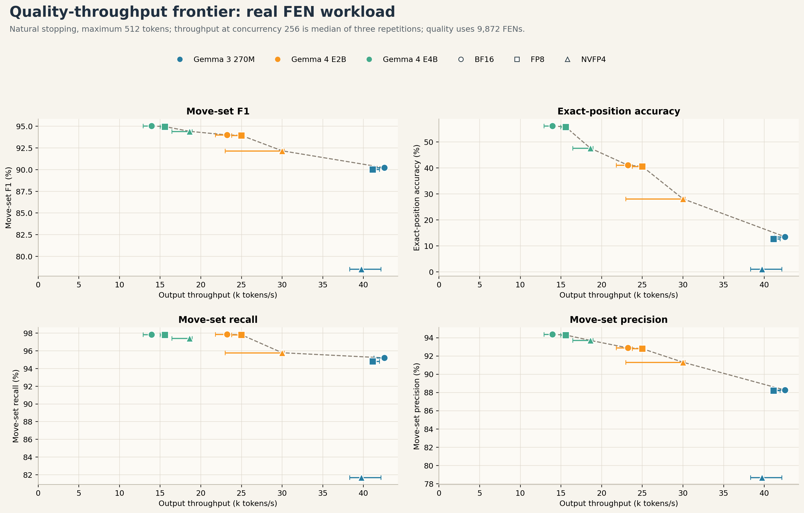
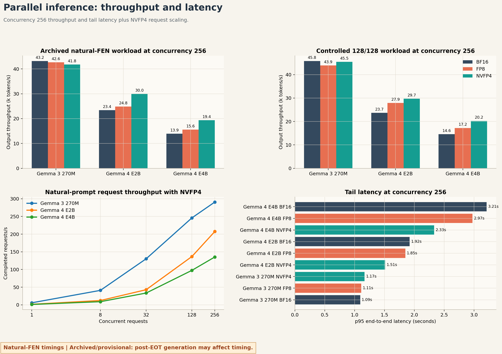
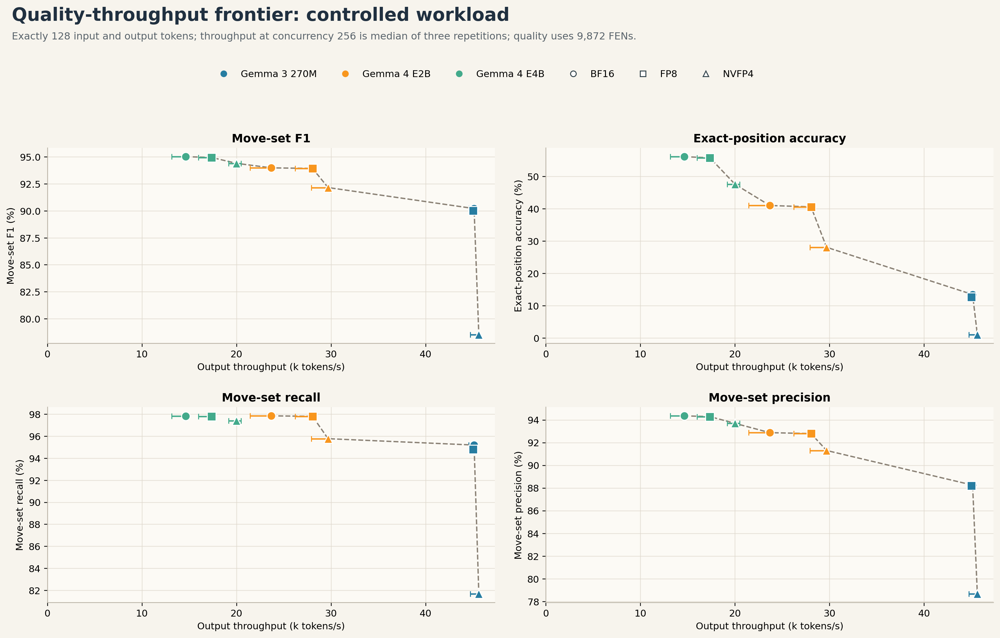

# Chess Legal-Move Language Models

**Supervised fine-tuning, parameter-efficient adaptation, quantized inference, and reproducible vLLM benchmarking for exact chess-state reasoning from FEN.**


[](https://github.com/ProttiProtto/llm-chess-move-learning/actions/workflows/evaluation-tests.yml)
[](LICENSE)

This project asks a deliberately strict question:

> Can a small instruction-tuned language model read a chess position in FEN and enumerate **every legal move**, in UCI notation, without access to a chess engine at inference time?

The task is simple to verify but difficult for a generative model. Success requires local piece-movement knowledge, occupancy tracking, side-to-move state, sliding-piece ray tracing, castling and promotion syntax, and global king-safety constraints. Unlike a subjective text-generation benchmark, every prediction has an exact deterministic oracle through `python-chess`.

The completed experiment fine-tuned Gemma 3 270M, Gemma 4 E2B, and Gemma 4 E4B with LoRA ranks 16 and 32. It then merged the adapters, exported BF16, FP8, and native NVFP4 checkpoints, evaluated 27 deployment variants on a leakage-audited held-out set, and benchmarked rank-32 models under 270 vLLM concurrency scenarios on Blackwell.

## Highlights

- Gemma 4 E4B rank-32 reached **95.03% move-set F1** and **56.12% exact-position accuracy** on 9,872 held-out positions.
- Under the same prompt, parser, and deterministic decoding contract, base E4B achieved **0.92% F1**, while rank-32 LoRA SFT reached **95.03%**.
- FP8 preserved E4B quality almost exactly at **94.96% F1** and **55.77% exact accuracy**. At concurrency 256, it delivered 19% higher output-token throughput on the fixed 128-input/128-output workload and 12% higher throughput on natural FEN prompts than BF16.
- At concurrency 256 on the fixed 128-input/128-output workload, E4B NVFP4 delivered **37% higher output-token throughput** than BF16; the natural-FEN gain was 33%, while exact accuracy fell to **47.58%**.
- Rank 32 outperformed rank 16 in these single-seed runs for all three model sizes.
- Check positions were only **4.57%** of the test set but caused **63.52%** of E4B rank-32 BF16's unique illegal predicted moves.
- All **270 serving scenarios** completed successfully: 110,592 measured requests, zero failed requests, five concurrency levels, two workload modes, and three repetitions.
- The repository records checkpoint hashes, dataset hashes, prompts, generation settings, raw predictions, package versions, exact token counts, training time, and tail latency.

**Artifacts:** [models and adapters](ARTIFACTS.md#model-repositories) | [processed dataset](ARTIFACTS.md#dataset-repository) | [raw results](https://github.com/ProttiProtto/llm-chess-move-learning/releases) | [publication checklist](ARTIFACTS.md)

| Artifact | Location | Current repository status |
|---|---|---|
| Source, tests, notebooks, and plots | GitHub | Included |
| Raw predictions and benchmark reports | GitHub Release or Hugging Face dataset | External release artifact |
| Processed SFT/validation/test data | Hugging Face dataset | External release artifact |
| LoRA adapters and merged checkpoints | Hugging Face models | External release artifact |
| Original Lichess puzzle archive | [Official Lichess database](https://database.lichess.org/) | Linked, not duplicated |



## Table of Contents

- [Why this task](#why-this-task)
- [System design](#system-design)
- [Dataset](#dataset)
- [Training methodology](#training-methodology)
- [Precision and quantization](#precision-and-quantization)
- [Evaluation methodology](#evaluation-methodology)
- [Results](#results)
- [What we learned](#what-we-learned)
- [Reproducing the project](#reproducing-the-project)
- [Repository guide](#repository-guide)
- [Testing and CI](#testing-and-ci)
- [Artifact publication](#artifact-publication)
- [Limitations](#limitations)
- [Next steps](#next-steps)
- [Licensing and attribution](#licensing-and-attribution)

## Why This Task

Legal-move enumeration is a useful AI engineering benchmark because it combines symbolic state tracking with autoregressive generation.

- **The oracle is exact.** `python-chess` deterministically produces the complete legal set for any valid FEN.
- **Partial success is measurable.** Precision, recall, and F1 reveal whether the model omits legal moves or adds illegal moves.
- **Exact success is demanding.** One missing move or one illegal extra move makes the full position incorrect.
- **Errors are interpretable.** Results can be stratified by check status, legal-move count, castling, promotion, pins, and other board conditions.
- **The system exposes deployment tradeoffs.** Quantization may preserve average F1 while reducing exact-set accuracy, which matters for reliability-sensitive applications.
- **The task is demonstrable.** A base model, fine-tuned model, deterministic verifier, and batched serving system can be compared with the same prompt and ground truth.

This is not an attempt to replace a chess engine. A rules engine is faster, exact, and the correct production solution for legal-move generation. The point is to study how language models learn deterministic state constraints, how capacity scales, and how inference optimization changes the quality-throughput frontier.

## Task Definition

The model receives one FEN and must emit only space-separated UCI moves in lexicographic order.

```text
You are playing chess. Given this position in FEN, output every legal move
in UCI notation, sorted lexicographically.
FEN: <position>

Respond with ONLY the UCI moves separated by single spaces, such as
a2a3 a2a4 b1a3 b1c3.
```

Canonical ordering removes output-order ambiguity. The evaluator still reports both set-exact and ordered-exact accuracy so formatting and chess correctness can be separated.

## System Design

```mermaid
flowchart LR
    A[Official Lichess puzzle CSV.zst] --> B[Streaming quality filter]
    B --> C[Game-hash split]
    C --> D[FEN deduplication]
    D --> E[Balanced rating/theme sampling]
    E --> F[python-chess legal-move oracle]
    F --> G[60k all-moves SFT positions]
    G --> H[Gemma 3 270M / Gemma 4 E2B / E4B]
    H --> I[LoRA rank 16 and 32]
    I --> J[Resumable checkpoints]
    J --> K[128-position checkpoint selection]
    K --> L[Merge adapter into BF16]
    L --> M[BF16 export]
    L --> N[FP8 W8A8 export]
    L --> O[NVFP4 W4A4 export]
    M --> P[9,872-position quality evaluation]
    N --> P
    O --> P
    P --> Q[vLLM concurrency benchmark]
    Q --> R[Quality-throughput analysis]
```



The project separates concerns deliberately:

1. Dataset construction is CPU-friendly and reproducible.
2. Training is Drive-backed and optimized for Colab GPU runtimes.
3. Checkpoint selection is deferred so autoregressive validation does not slow the training loop.
4. Quantization happens after the LoRA adapter is merged into a canonical BF16 model.
5. Quality evaluation and serving performance are separate experiments.
6. Every published result is tied to dataset, config, and checkpoint hashes.

## Dataset

### Source corpus

The data pipeline was designed from the complete official Lichess puzzle export dated 2026-07-05:

| Property | Value |
|---|---:|
| Total puzzles scanned | 6,057,356 |
| Mean puzzle rating | 1,472.4 |
| Rating standard deviation | 547.4 |
| Puzzles passing quality filter | 3,147,053 |
| Training positions | 60,000 |
| GRPO-reserved positions | 15,000 |
| Validation positions | 10,000 |
| Final test positions | 9,872 |

The quality filter required:

```text
RatingDeviation <= 80
Popularity >= 50
NbPlays >= 100
```

### Position extraction

For each puzzle, the builder applies the first move in the Lichess solution line, which represents the opponent's preceding move, and uses the resulting tactical position. Only one position is taken from each puzzle. This avoids overweighting puzzles with longer solution lines.

`python-chess` then generates every legal UCI move from that position. Positions with more than 80 legal moves are skipped rather than truncating their targets. A truncated target would incorrectly teach the model that an incomplete move set is valid.

### Leakage prevention

The split is designed around source games, not individual rows:

- Source game IDs are deterministically assigned by hash.
- Source-game hashes are assigned to 68% SFT, 20% GRPO, and 12% validation partitions before capped, balanced sampling.
- The published capped datasets contain 60,000 SFT, 15,000 GRPO, and 10,000 validation positions, or approximately 70.6%, 17.6%, and 11.8% of the selected 85,000 positions.
- Canonical FENs are deduplicated across ordered splits.
- The final evaluator checks both canonical-FEN collisions and source-game collisions against training.
- The first 128 validation positions are reserved for checkpoint selection.
- The final 9,872-position test set explicitly excludes those 128 positions.

The completed publication split reported zero training FEN collisions and zero training game collisions.

### Distribution balancing

Uniform sampling would overrepresent low-rated and common mate/endgame puzzles. The builder therefore samples across rating buckets and broad theme families.

Rating targets range from 6% below 1,000 to 0.9% at 2,600+. Within each rating tier, target theme shares are 30% mate, 35% tactical, 25% endgame, and 10% other. Sparse intersections are backfilled from the same rating tier instead of silently reducing the dataset size.

This matters because benchmark quality is only meaningful when the train/test distribution is explicit and difficult cases are not accidentally removed.

## Training Methodology

### Models

| Family | Model | Role |
|---|---|---|
| Gemma 3 | `google/gemma-3-270m-it` | Small capacity and throughput baseline |
| Gemma 4 | `google/gemma-4-E2B-it` | Mid-scale efficiency model |
| Gemma 4 | `google/gemma-4-E4B-it` | Highest-capacity model in the experiment |

### Parameter-efficient fine-tuning

All six reported training runs used BF16 base weights with BF16 LoRA adapters. Two adapter capacities were tested:

| Setting | Rank | Alpha | Dropout |
|---|---:|---:|---:|
| Low-rank | 16 | 32 | 0.05 |
| Higher-rank | 32 | 64 | 0.05 |

LoRA targeted the attention and MLP projections:

```text
q_proj, k_proj, v_proj, o_proj,
gate_proj, up_proj, down_proj
```

LoRA was chosen because it makes six model/rank experiments feasible without storing a complete trainable copy of every model. It also creates a clean deployment workflow: retain a compact adapter during experimentation, select the best checkpoint, then merge exactly once before quantization.

### Shared optimization configuration

| Hyperparameter | Value |
|---|---:|
| Training positions | 60,000 |
| Epochs | 5 |
| Optimizer steps | 9,375 |
| Per-device microbatch | 8 |
| Gradient accumulation | 4 |
| Effective batch | 32 |
| Maximum sequence length | 512 |
| Learning rate | 2e-4 |
| Weight decay | 0.01 |
| Warmup ratio | 0.03 |
| Optimizer | Fused AdamW |
| Seed | 42 |
| Checkpoint interval | 300 optimizer steps |

The effective batch was held at 32 across models. This is important for a fair model comparison: changing both model size and effective batch would confound optimization behavior.

### `torch.compile` strategy

The training pipeline supports full-model and regional compilation with TorchInductor.

- Gemma 3 uses full-model compilation when supported.
- Gemma 4 uses regional decoder-layer compilation.
- Regional compilation avoids a failing monolithic Gemma 4 AOTAutograd graph while preserving repeated-layer kernel fusion.
- Dynamic shapes reduce recompilation caused by variable padded sequence lengths.
- TF32 is enabled for remaining FP32 matrix operations.
- Gradient checkpointing is disabled when the model fits in memory because recomputation trades speed for VRAM.

Gemma 4 required model-specific handling because its clippable linear wrappers are not directly supported by PEFT's standard LoRA injector. The pipeline resolves eligible wrapped projections to their inner `torch.nn.Linear` modules while keeping checkpoint names stable.

### Resumability and telemetry

Colab sessions are interruptible, so checkpointing is part of the system design rather than an afterthought.

Each recovery checkpoint stores the LoRA adapter, optimizer, scheduler, Trainer, and RNG state plus the exact runtime configuration. Rerunning the training cell resumes the latest valid Trainer checkpoint automatically. Final adapters are saved to Drive before optional validation or export work begins.

Telemetry records training time, throughput, GPU and package versions, peak GPU/RAM usage, parameter counts, precision and LoRA settings, checkpoint size, and exact token accounting. Token summaries distinguish unique input tokens, supervised tokens, repeated epoch tokens, padding, and truncation.

### Deferred checkpoint evaluation

Autoregressive all-move generation is much slower than teacher-forced training. Running it every few hundred steps can dominate wall time and distort training-throughput measurements.

The final workflow saves resumable checkpoints every 300 steps, trains without periodic autoregressive validation, evaluates checkpoints afterward on the frozen 128-position selection set, selects by all-moves F1, and uses the untouched 9,872 positions only for final reporting.


## Precision and Quantization

The published quality comparison uses **BF16 SFT followed by post-training deployment conversion**. It does not claim that the headline models were trained end-to-end with packed FP8 or NVFP4 weights.

### BF16

BF16 is the numerical baseline. It retains an FP32-like exponent range while using two bytes per stored value. The final LoRA adapter is merged into a fresh BF16 copy of the base model. This merged checkpoint is the canonical source for every deployment format.

### FP8

The FP8 export is a merged W8A8-style checkpoint using dynamic activation quantization and persistent FP8 weights through the compressed-tensors/Transformers integration.

- Weights use static fine-grained scaling.
- Activations are scaled dynamically at runtime.
- The model no longer requires PEFT after merge and export.
- Conversion happens after LoRA merge, avoiding direct addition of BF16 adapter deltas into FP8 byte representations.

FP8 is valuable when the model is large enough for Tensor Core GEMMs to dominate runtime. Small models may see little benefit because scaling, kernel launch, token sampling, and scheduler overhead remain.

### NVFP4

The deployment export uses native NVIDIA ModelOpt NVFP4 W4A4 checkpoints served with Blackwell-native kernels.

NVFP4 represents values with E2M1 four-bit floating-point values. Groups of 16 values share an FP8 block scale, and a higher-level global scale preserves usable dynamic range. This is different from generic symmetric INT4.

The Blackwell serving configuration used FlashInfer CUTLASS dense linear kernels and B12x MoE kernels. On the measured workloads at concurrency 256, NVFP4 produced larger throughput gains than FP8 for E2B and E4B. The quality cost was model-dependent, and exact-set accuracy was more sensitive than average F1.

### Optional training precision modes

The codebase also implements optional TorchAO FP8 mixed-precision LoRA training and experimental NVFP4 fake-QAT.

- FP8 training casts eligible forward/backward GEMM operands to FP8 while retaining BF16 master weights and higher-precision LoRA/optimizer state.
- NVFP4 QAT simulates the NVFP4 numerical grid during training but does not provide native packed-FP4 training speed.
- These modes are useful follow-up experiments, but they are not the source of the published six-run BF16 training results.

This workflow should not be called conventional QLoRA. QLoRA normally keeps a persistently quantized frozen base model during adapter training. Here, the reported adapters were trained against BF16 base weights, merged in BF16, and quantized for inference afterward.

See [`fen_move_colab/PRECISION_AND_PERFORMANCE.md`](fen_move_colab/PRECISION_AND_PERFORMANCE.md) for tensor-level details.

## Evaluation Methodology

### Correct generation stopping

Gemma generation must stop at `<end_of_turn>`. The publication evaluator gives vLLM an explicit EOT stop string and independently discards everything after the first EOT marker before parsing. A regression test verifies that a move emitted after EOT cannot reduce exact accuracy.

### Prompt audit

Training and evaluation both call the same `make_all_legal_moves_instruction(fen)` function and use the same Gemma turn wrapper. The evaluator regenerates prompts from FEN rather than trusting a legacy instruction field stored in validation JSONL. `prompt_audit.json` records this as a matched-training-prompt evaluation.

### Quality metrics

For each position, let `P` be the unique predicted UCI moves and `L` be the legal move set.

```text
precision = |P intersect L| / |P|
recall    = |P intersect L| / |L|
F1        = harmonic mean of precision and recall
exact     = 1 if P == L, else 0
```

Precision, recall, and F1 are macro-averaged over positions. Exact-position accuracy is the fraction of positions for which the entire predicted set is correct.

The table's **Illegal predicted moves (micro)** metric is:

```text
sum(unique valid predicted UCI moves not legal in their position)
----------------------------------------------------------------
sum(all unique valid predicted UCI moves)
```

Parsing first truncates at `<end_of_turn>`, lowercases and whitespace-splits the remaining text, removes duplicate valid UCI moves, and then compares the resulting unique move set with engine-generated ground truth. Malformed UCI strings are not included in either the numerator or denominator; they are recorded separately and make the strict-format check fail. Because precision in the table is macro-averaged by position while this illegal prediction rate is micro-aggregated over moves, the rate is not `100% - macro precision`.

The evaluator also reports strict-format rate, empty-output rate, check/non-check subsets, EOT observation, and raw predictions.

### Publication split

The final quality evaluation used 128 positions for checkpoint selection, 9,872 disjoint positions for final testing, 27 model variants, deterministic decoding, a 512-token output cap, and exact dataset/config/checkpoint hashes.

### Serving benchmark

Performance was measured separately on an NVIDIA RTX PRO 6000 Blackwell Server Edition with PyTorch 2.13.0+cu132, Transformers 5.14.1, and vLLM 0.27.0.

| Mode | Input | Output | Purpose |
|---|---|---|---|
| Natural FEN | Real held-out chess prompts | Natural EOT stopping, max 512 | Deployment behavior |
| Fixed tokens | Random 128-token prompts | Exactly 128 generated tokens | Controlled hardware comparison |

Every rank-32 checkpoint ran at concurrency 1, 8, 32, 128, and 256 with three repetitions. vLLM used continuous batching with `max_num_seqs=256`, `max_num_batched_tokens=16384`, chunked prefill, and prefix caching disabled.

Measured requests per repetition were 128, 128, 256, 512, and 1,024 as concurrency increased. Each scenario also used 16 warmup requests.

## Results

### BF16 adaptation and LoRA rank

All values below come from the corrected 9,872-position final test set.

| Model | Adaptation | Precision | Recall | F1 | Exact position | Illegal predicted moves (micro) |
|---|---|---:|---:|---:|---:|---:|
| Gemma 3 270M | Base | 7.44% | 0.44% | 0.82% | 0.00% | 87.64% |
| Gemma 3 270M | LoRA r16 | 83.99% | 93.40% | 87.01% | 5.73% | 14.85% |
| Gemma 3 270M | LoRA r32 | **88.26%** | **95.21%** | **90.22%** | **13.48%** | **10.61%** |
| Gemma 4 E2B | Base | 14.72% | 1.24% | 2.27% | 0.00% | 84.00% |
| Gemma 4 E2B | LoRA r16 | 92.58% | 97.62% | 93.77% | 38.45% | 6.67% |
| Gemma 4 E2B | LoRA r32 | **92.88%** | **97.86%** | **94.00%** | **41.01%** | **6.43%** |
| Gemma 4 E4B | Base | 5.27% | 0.53% | 0.92% | 0.00% | 91.32% |
| Gemma 4 E4B | LoRA r16 | 93.49% | 97.73% | 94.40% | 47.61% | 5.90% |
| Gemma 4 E4B | LoRA r32 | **94.37%** | **97.84%** | **95.03%** | **56.12%** | **4.91%** |

Rank 32 outperformed rank 16 in these runs, especially on exact-position accuracy. Because there is one training seed per configuration, this is an observation from this experiment rather than a universal property of LoRA rank.

### Rank-32 deployment quality

| Model | Format | Precision | Recall | F1 | Exact position | Illegal predicted moves (micro) |
|---|---|---:|---:|---:|---:|---:|
| Gemma 3 270M | BF16 | 88.26% | 95.21% | 90.22% | 13.48% | 10.61% |
| Gemma 3 270M | FP8 | 88.21% | 94.81% | 90.01% | 12.68% | 10.65% |
| Gemma 3 270M | NVFP4 | 78.68% | 81.69% | 78.54% | 1.07% | 20.36% |
| Gemma 4 E2B | BF16 | 92.88% | 97.86% | 94.00% | 41.01% | 6.43% |
| Gemma 4 E2B | FP8 | 92.80% | 97.82% | 93.95% | 40.60% | 6.50% |
| Gemma 4 E2B | NVFP4 | 91.31% | 95.79% | 92.17% | 28.09% | 7.91% |
| Gemma 4 E4B | BF16 | 94.37% | 97.84% | 95.03% | 56.12% | 4.91% |
| Gemma 4 E4B | FP8 | 94.30% | 97.82% | 94.96% | 55.77% | 4.98% |
| Gemma 4 E4B | NVFP4 | 93.70% | 97.42% | 94.42% | 47.58% | 5.60% |

FP8 provided the strongest overall quality-efficiency result in this benchmark. It preserved E2B and E4B F1 within 0.07 percentage points of BF16 and exact accuracy within 0.41 points.

NVFP4 has a larger and highly model-dependent quality cost. E4B retains strong move-level metrics, while E2B loses 12.92 exact-accuracy points and 270M loses most of its exact-set capability.

### Rank-32 serving throughput

Median output-token throughput at concurrency 256:

| Model | Format | Fixed 128x128 | Fixed vs BF16 | Natural FEN | Natural vs BF16 |
|---|---|---:|---:|---:|---:|
| Gemma 3 270M | BF16 | 45.1k tok/s | 1.00x | 42.6k tok/s | 1.00x |
| Gemma 3 270M | FP8 | 45.0k tok/s | 1.00x | 41.1k tok/s | 0.97x |
| Gemma 3 270M | NVFP4 | 45.6k tok/s | 1.01x | 39.7k tok/s | 0.93x |
| Gemma 4 E2B | BF16 | 23.7k tok/s | 1.00x | 23.2k tok/s | 1.00x |
| Gemma 4 E2B | FP8 | 28.0k tok/s | **1.18x** | 25.0k tok/s | **1.08x** |
| Gemma 4 E2B | NVFP4 | 29.7k tok/s | **1.25x** | 30.0k tok/s | **1.29x** |
| Gemma 4 E4B | BF16 | 14.6k tok/s | 1.00x | 13.9k tok/s | 1.00x |
| Gemma 4 E4B | FP8 | 17.3k tok/s | **1.19x** | 15.6k tok/s | **1.12x** |
| Gemma 4 E4B | NVFP4 | 20.0k tok/s | **1.37x** | 18.6k tok/s | **1.33x** |

At natural-prompt concurrency 256, NVFP4 reduced p95 end-to-end latency from 1.93s to 1.49s for E2B and from 3.20s to 2.46s for E4B.

Gemma 3 270M did not benefit from quantization in this workload. Its serving path is small enough that kernel launch, scaling, scheduling, sampling, or other non-matmul work may limit the benefit; identifying the dominant cause would require targeted profiling.




### Check versus non-check

| Model, BF16 r32 | Overall F1 | Non-check F1 | In-check F1 | Overall exact | In-check exact |
|---|---:|---:|---:|---:|---:|
| Gemma 3 270M | 90.22% | 93.48% | 22.22% | 13.48% | 0.00% |
| Gemma 4 E2B | 94.00% | 97.36% | 23.73% | 41.01% | 0.00% |
| Gemma 4 E4B | 95.03% | 98.21% | 28.58% | 56.12% | 2.44% |

Check positions represent only 4.57% of the final test set. For E4B rank-32 BF16, they generated 63.52% of all unique valid UCI predictions that were illegal. This suggests that the models learned strong local movement patterns but remained weak at enforcing the global condition that every generated move must leave the king safe.

### Training cost

| Model | Rank | Train loss | Training loop | Processed input tokens | Input tokens/s |
|---|---:|---:|---:|---:|---:|
| Gemma 3 270M | 16 | 0.1472 | 33.0 min | 73.3M | 37.0k |
| Gemma 3 270M | 32 | 0.1192 | 32.8 min | 73.3M | 37.3k |
| Gemma 4 E2B | 16 | 0.0613 | 144.9 min | 79.9M | 9.2k |
| Gemma 4 E2B | 32 | 0.0531 | 143.6 min | 79.9M | 9.3k |
| Gemma 4 E4B | 16 | 0.0415 | 209.7 min | 79.9M | 6.3k |
| Gemma 4 E4B | 32 | 0.0379 | 208.8 min | 79.9M | 6.4k |

Cross-family train loss is not a direct quality metric because tokenizers and architectures differ. The common held-out generation metrics are the meaningful comparison.


## What We Learned

### 1. Task-specific SFT created reliable behavior under the evaluation contract

Under the same strict prompt, parser, and deterministic decoding contract, the base models had near-zero recall and zero exact-position accuracy. LoRA SFT moved E2B and E4B above 93% F1, demonstrating that a compact adapter can teach reliable compliance with this structured task. These prompt-only scores do not establish that the base models contained no latent chess knowledge.

### 2. F1 and exact accuracy answer different questions

E4B rank-32 BF16 achieved 95.03% F1 but only 56.12% exact-position accuracy. A high F1 means most individual moves are correct; it does not mean most positions are completely solved.

### 3. Model scaling improved completion of the final details

E2B and E4B rank-32 BF16 differ by only 1.03 F1 points, but E4B improves exact accuracy by 15.11 points. The larger model is especially better at avoiding the final omission or extra move that invalidates an otherwise strong set.

### 4. FP8 offered the best quality-throughput frontier

FP8 preserved E2B/E4B quality. At concurrency 256 on the fixed 128-input/128-output workload, output-token throughput improved by 18% for E2B and 19% for E4B; on natural FEN prompts, the gains were 8% and 12%. Low precision is useful only when serialization, kernels, workload, concurrency, and quality are validated together.



### 5. NVFP4 was not uniformly safe

At concurrency 256, NVFP4 delivered the highest E2B/E4B output-token throughput in both measured workloads, but exact accuracy declined substantially. The 270M model suffered severe degradation without a meaningful speed gain. The result is not that NVFP4 is universally poor; it is that post-training NVFP4 was not accuracy-safe for every model in this workload.

### 6. Quantization speedup depends on arithmetic intensity

E4B benefited more than E2B, while 270M did not benefit. Quantization accelerates tensor operations, not scheduler, tokenizer, sampling, or kernel-launch overhead.

### 7. Check handling is the primary legal-move-enumeration failure

The check/non-check gap indicates that the models often know how pieces move but fail to apply the global king-safety filter. This gives the project a concrete target for curriculum learning, verifier-guided decoding, or reinforcement learning.

### 8. Teacher-forced loss is not enough

Training loss declined smoothly, but checkpoint quality did not always peak at the final optimizer step. Autoregressive checkpoint evaluation was therefore necessary. Token-level loss and sequence-level correctness can diverge.

### 9. Benchmark correctness is part of model engineering

The publication workflow corrected unnecessary post-EOT generation, post-EOT parsing, and selection/test overlap risks. Checkpoint selection now uses the same EOT-aware parser as final scoring, and throughput results must match the exact quality-evaluated checkpoint hash. Prompts, stopping, parsing, splits, and hashes are treated as part of the experiment contract.

## Reproducing the Project

### Prerequisites

Dataset construction can run locally with Python 3.11. Training and vLLM evaluation require a CUDA GPU. Native NVFP4 inference requires Blackwell.

```bash
git clone https://github.com/ProttiProtto/llm-chess-move-learning.git
cd llm-chess-move-learning
python -m pip install -e ".[test]"
```

The editable install is the canonical local and CI setup. A CPU-only Conda environment is also provided for dataset work:

```bash
conda env create -f fen_move_colab/environment-data.yml
conda activate chess-fen-data
python -m pip install -e ".[test]"
```

The `chess-fen-data` environment is intentionally CPU-only and supports dataset construction, metric recomputation, and tests. Optional local dependency groups are available as `.[training]`, `.[publication]`, and `.[dev]`. The Colab notebooks install the separate training and serving dependencies into their CUDA runtime. In particular, `requirements-colab.txt` deliberately omits PyTorch so it does not replace Colab's CUDA-matched build; run the direct training and GPU evaluation commands below only after the corresponding notebook setup cells have completed.

### Download and build the Lichess dataset

Download the official compressed Lichess puzzle CSV and place it at `data/raw/lichess_db_puzzle.csv.zst`. Large raw and generated data are ignored by Git.

```bash
python -m fen_move_colab.build_benchmark_datasets \
  --puzzle-csv data/raw/lichess_db_puzzle.csv.zst \
  --output-dir data/processed/lichess_legal_v1

python -m fen_move_colab.build_all_legal_moves_dataset \
  --source data/processed/lichess_legal_v1/sft_train.jsonl \
  --output data/processed/lichess_legal_v1/sft_all_legal_moves_v2_max80.jsonl \
  --max-legal-moves 80
```

### Build the Google Drive bundle

```bash
python -m fen_move_colab.package_colab_bundle \
  --output-dir colab_drive_bundle \
  --raw-csv data/raw/lichess_db_puzzle.csv.zst \
  --overwrite
```

Upload the resulting folder directly to `MyDrive/colab_drive_bundle/`.

### Expected Drive layout

```text
MyDrive/colab_drive_bundle/
  SFT_All_Legal_Moves_Colab.ipynb
  VLLM_Checkpoint_Export_Colab.ipynb
  VLLM_Publication_Evaluation_Colab.ipynb
  VLLM_Parallelism_Benchmark_Colab.ipynb
  train_sft_chunk.py
  evaluate_sft_checkpoints.py
  raw/
    lichess_db_puzzle.csv.zst
  datasets/
    lichess_legal_v1/
  runs/
  vllm_exports/
```

### Train in Colab

Open `SFT_All_Legal_Moves_Colab.ipynb` and configure Cell 2:

```python
BASE_MODEL_OR_CHECKPOINT = "google/gemma-4-E4B-it"
RUN_NAME = "gemma4_e4b_all_legal_moves_v3"
SFT_CHUNK_POSITIONS = 60000
MAX_SEQ_LENGTH = 512
NUM_TRAIN_EPOCHS = 5
PER_DEVICE_BATCH_SIZE = 8
GRADIENT_ACCUMULATION = 4
LEARNING_RATE = 2.0e-4
CHECKPOINT_SAVE_STEPS = 300
VALIDATION_DURING_TRAINING = False
USE_LORA = True
```

Set LoRA rank 32 with alpha 64, or rank 16 with alpha 32. Run the notebook cells in order. Code runs from local Colab storage while datasets and checkpoints remain on Drive.

The notebook-generated YAML can also be launched directly:

```bash
python -m fen_move_colab.train_sft_chunk \
  --config fen_move_colab/all_legal_moves_runtime.yaml \
  --chunk-samples 60000
```

### Evaluate checkpoints

```bash
python -m fen_move_colab.evaluate_sft_checkpoints \
  --config fen_move_colab/all_legal_moves_runtime.yaml \
  --samples 128 \
  --batch-size 8 \
  --max-new-tokens 512
```

### Merge and quantize

Open `VLLM_Checkpoint_Export_Colab.ipynb` and provide export specs. The notebook loads the BF16 base and selected adapter, merges in BF16, saves the canonical merged checkpoint, converts independent copies to FP8/NVFP4, and records quantization metadata and hashes.

Do not quantize first and then add a BF16 LoRA delta directly to packed weights.

### Run publication evaluation

Open `VLLM_Publication_Evaluation_Colab.ipynb`, or update the model paths in `config_publication_eval.yaml` and run:

```bash
python -m fen_move_colab.run_publication_evaluation \
  --config fen_move_colab/config_publication_eval.yaml
```

The evaluator saves the full contract, environment, prompt audit, split manifest, checkpoint hashes, raw predictions, worker logs, and comparison report.

### Run serving benchmarks

Open `VLLM_Parallelism_Benchmark_Colab.ipynb`, or resolve the quality/test-set paths in `config_parallelism_benchmark.yaml` and run:

```bash
python -m fen_move_colab.run_parallelism_benchmark \
  --config fen_move_colab/config_parallelism_benchmark.yaml
```

The benchmark resumes at scenario granularity and saves raw vLLM results plus consolidated CSV/JSON reports.

### Rebuild README figures

```bash
python -m pip install -e ".[analysis]"
python -m analysis.build_readme_figures \
  --quality-comparison path/to/publication_eval/comparison.json \
  --performance-csv path/to/parallelism/performance_comparison.csv \
  --training-metrics path/to/training-metrics/*.zip
```

See [`analysis/README.md`](analysis/README.md) for accepted inputs and table-only generation.

### Recompute metrics offline

```bash
python -m fen_move_colab.recompute_publication_metrics \
  --input path/to/publication_eval.zip \
  --output-dir corrected_metrics
```

This corrects parsing and quality metrics without a GPU. Throughput must be rerun if the original generation produced unnecessary post-EOT text.

## Repository Guide

| Path | Purpose |
|---|---|
| `fen_move_colab/SFT_All_Legal_Moves_Colab.ipynb` | Main all-legal-moves training notebook |
| `fen_move_colab/train_sft_chunk.py` | Resumable LoRA SFT and telemetry |
| `fen_move_colab/evaluate_sft_checkpoints.py` | Deferred checkpoint evaluation |
| `fen_move_colab/build_benchmark_datasets.py` | Streaming Lichess filtering and splitting |
| `fen_move_colab/build_all_legal_moves_dataset.py` | Canonical all-moves targets |
| `fen_move_colab/fp8_lora.py` | BF16, FP8, and NVFP4-QAT preparation |
| `fen_move_colab/VLLM_Checkpoint_Export_Colab.ipynb` | Merge and quantized export workflow |
| `fen_move_colab/VLLM_Publication_Evaluation_Colab.ipynb` | Corrected 27-run quality evaluation |
| `fen_move_colab/VLLM_Parallelism_Benchmark_Colab.ipynb` | Serving benchmark |
| `fen_move_colab/publication_eval.py` | Prompt, split, parser, and metric contracts |
| `fen_move_colab/offline_vllm_worker.py` | Batched offline vLLM quality worker |
| `fen_move_colab/run_parallelism_benchmark.py` | Online vLLM benchmark orchestration |
| `analysis/` | Rebuilds normalized result tables and all six README figures from raw outputs |
| `ARTIFACTS.md` | External artifact, hash, card, and licensing checklist |
| `tests/` | CPU correctness tests |
| `.github/workflows/evaluation-tests.yml` | GitHub Actions CI |
| `assets/` | README plots |

The public tree intentionally contains only the supported all-moves training, export, quality-evaluation, and speed-benchmark workflows. Earlier exploratory notebooks and stale pipeline code are excluded.

## Testing and CI

```bash
python -m pip install -e ".[dev]"
ruff check fen_move_colab tests analysis
python -m pytest -q
```

GitHub Actions creates clean Python 3.11 and 3.12 environments, runs Ruff, and executes the CPU suite on every push and pull request. Installing the package through `pyproject.toml` also exercises the declared transitive dependencies, including `pandas`. Tests cover invalid FEN rejection, legal-move generation, UCI parsing, EOT truncation, post-EOT regression behavior, metric aggregation, check stratification, prompt audits, split/leakage checks, benchmark scenario construction, and partial benchmark failure rejection.

GPU training and vLLM kernel tests are intentionally excluded from hosted CPU CI.

## Artifact Publication

Large outputs are distributed separately so Git remains reviewable. [`ARTIFACTS.md`](ARTIFACTS.md) defines publication destinations, required hashes and provenance, model/dataset card fields, hardware metadata, and the boundary between the MIT code license and third-party model terms. [`artifact_manifest.example.json`](artifact_manifest.example.json) is a machine-readable starting point for each upload.

## Reproducibility

Publication runs record full runtime configs, dataset and checkpoint hashes, model/tokenizer provenance, prompt contracts, generation parameters, stopping configuration, package/CUDA/GPU versions, scheduler and KV-cache settings, raw predictions, and repetition-level performance output.

This matters because a model name alone does not reproduce a quantized serving experiment. Kernel backend, quantization metadata, prompt framing, stopping behavior, and scheduler settings all affect results.

## Limitations

- There is one training seed per configuration.
- Results describe these Gemma checkpoints, this dataset, and this hardware.
- Tactical Lichess positions are not uniform over all reachable chess states.
- Check positions are uncommon, so their subset estimates have wider uncertainty.
- Exact-position accuracy remains far below deterministic engine performance.
- The 270M model is especially sensitive to NVFP4 post-training quantization.
- Throughput still increased at concurrency 256, so saturation beyond the configured `max_num_seqs=256` was not measured.
- One E2B NVFP4 natural concurrency-256 repetition was a transient low-throughput outlier; medians are reported.
- Larger open and closed prompt-only baselines are not in the final reproducible matrix yet.
- Experimental GRPO, RAG, and tool-use extensions are not part of v1 results.

## Next Steps

- Build a balanced challenge set for check evasion, pins, castling, en passant, and promotions.
- Oversample king-safety constraints in a targeted curriculum.
- Add verifier-guided or constrained decoding.
- Use GRPO to vary illegal-extra penalties and map the precision-recall risk frontier.
- Compare post-training NVFP4 with merged-weight NVFP4 QAT.
- Explore Gemma 4 to Gemma 3 distillation.
- Add larger open and closed base-model baselines.
- Repeat key runs with additional seeds and bootstrap confidence intervals.
- Profile Blackwell kernels with Nsight Systems/Compute.
- Build an interactive board demo showing expected, missing, and illegal moves.

## AI Engineering Skills Demonstrated

- Streaming and stratified data engineering over a multi-million-row compressed corpus
- Leakage-aware source-group and canonical-state splits
- Deterministic supervision from a domain rules engine
- PEFT LoRA across multiple model scales and ranks
- Resumable cloud training and checkpoint recovery
- Exact token, memory, throughput, and environment telemetry
- PyTorch compilation and model-specific wrapper integration
- BF16, FP8, and native NVFP4 deployment conversion
- vLLM offline generation and continuous-batching benchmarks
- Quality-throughput Pareto analysis
- Evaluation contracts, hashing, prompt audits, and raw prediction retention
- Unit tests and CPU-friendly CI for high-risk evaluation logic
- Conservative interpretation of single-seed and hardware-specific findings

## Licensing and Attribution

- Original project source code is licensed under the [MIT License](LICENSE).
- The original Lichess archive is linked from the [official database](https://database.lichess.org/), which publishes database exports under CC0. The experiment used the 2026-07-05 puzzle snapshot.
- Gemma-derived adapters and merged or quantized checkpoints are not MIT-licensed. They must retain the terms linked by the corresponding Google base-model card, plus required restriction, notice, attribution, and modification information.
- `python-chess`, PyTorch, Transformers, PEFT, TorchAO, ModelOpt, FlashInfer, and vLLM retain their own licenses.
- Model weights, datasets, third-party binaries, and generated checkpoints are not relicensed by this repository and remain subject to their original terms.

## Acknowledgements

This project uses the Lichess puzzle corpus, Google Gemma models, `python-chess`, Hugging Face Transformers/PEFT, PyTorch/TorchAO, NVIDIA ModelOpt, FlashInfer, and vLLM.

Further implementation details:

- [`fen_move_colab/README.md`](fen_move_colab/README.md)
- [`fen_move_colab/LICHESS_DATA_PLAN.md`](fen_move_colab/LICHESS_DATA_PLAN.md)
- [`fen_move_colab/PRECISION_AND_PERFORMANCE.md`](fen_move_colab/PRECISION_AND_PERFORMANCE.md)
- [`fen_move_colab/PUBLICATION_EVALUATION.md`](fen_move_colab/PUBLICATION_EVALUATION.md)
