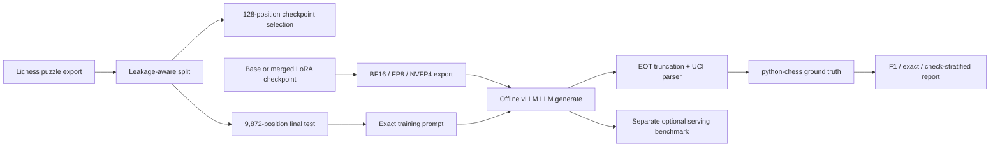

# Publication evaluation v1

This evaluator fixes the two correctness risks in the exploratory benchmark: it stops vLLM at Gemma's `<end_of_turn>` token and independently truncates saved text at the first marker before parsing UCI moves.



## Prompt audit

Training and evaluation both call `make_all_legal_moves_instruction(fen)` and use the same Gemma turn wrapper. The validation JSONL retains an older one-move `instruction` field, but that field is not sent to the model. The evaluator regenerates prompts from FEN and writes `prompt_audit.json`; therefore this is a matched-prompt evaluation, not a prompt-robustness test.

## Run in Colab

Upload the updated `fen_move_colab` package into `MyDrive/colab_drive_bundle`, open `VLLM_Publication_Evaluation_Colab.ipynb`, and run its cells in order. The final cell executes:

```bash
python -m fen_move_colab.run_publication_evaluation \
  --config fen_move_colab/config_publication_eval.yaml
```

The default config evaluates all 27 base/rank/precision combinations. It excludes the first 128 validation positions used for checkpoint selection, then verifies that the remaining 9,872 positions share neither canonical FENs nor source games with training.

## Saved evidence

Every run stores the exact runtime config, dataset and split hashes, checkpoint file hashes, package versions, model/tokenizer provenance, stop strings and any trustworthy stop IDs, generation settings, raw predictions, worker logs, and corrected quality metrics. Quality tables include move-set F1, exact-position accuracy, and separate check/non-check results.

Serving performance is a separate optional benchmark. It should use real FEN prompts with natural EOT stopping plus fixed input/output lengths, and report concurrency, requests/s, output tokens/s, TTFT, and end-to-end latency without blocking quality evaluation.

Memory fields deliberately separate checkpoint weight bytes, vLLM model-loading memory, KV-cache reservation, CUDA-graph memory, and whole-GPU NVML peak. The latter must not be described as model size.

## Offline correction

Existing prediction archives can be rescored without a GPU:

```bash
python -m fen_move_colab.recompute_publication_metrics \
  --input path/to/benchmark.zip \
  --output-dir corrected_metrics
```

This corrects quality metrics only. Throughput and latency must be rerun because the old benchmark generated unnecessary post-EOT tokens.

## Limitations

The default experiment has one training seed. Report rank comparisons as observations from these runs, not universal conclusions. High move-set F1 is not exact-position accuracy. Check positions remain a small but disproportionately difficult subset, and NVFP4 conclusions apply only to this short-context workload and serving stack.

## Licensing checklist

- Lichess database exports are published under CC0; cite the source and snapshot date.
- Gemma 3 and Gemma 4 may have different model terms. Preserve the exact model ID/revision and follow the license/model card that applies to each downloaded checkpoint or derivative.
- Stockfish is GPLv3. If a binary is redistributed, satisfy the corresponding source and notice obligations.
- This repository currently has no top-level code license. Choose and add one before a public release; do not imply that model or dataset terms are replaced by the code license.
